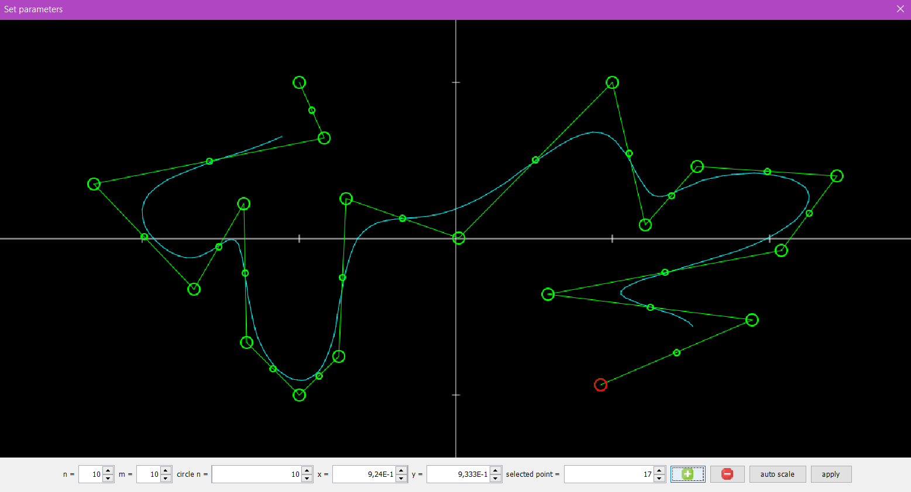
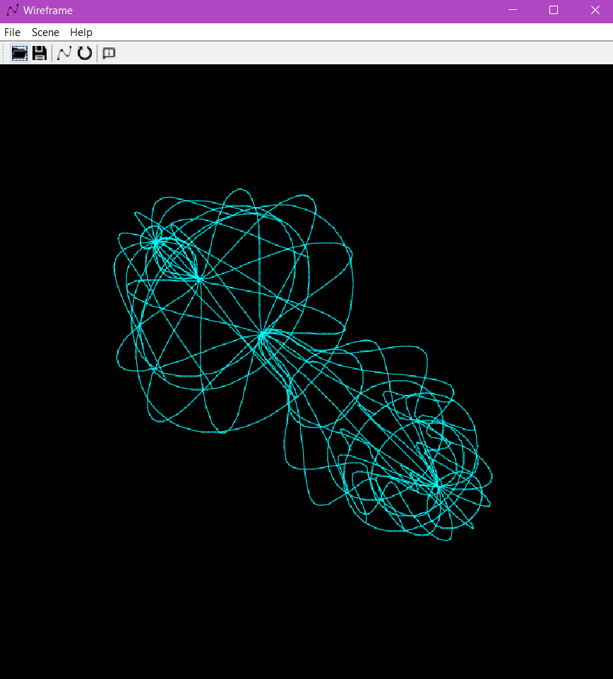

# Warframe-Graphics_4
Redactor for spline
Here you can construct your own spline model, and visualize it like a 3d figure
Also you can save your 3d model in file or open other saved model
Parameters:
n - smoothness (number of lines per spline section),
m - number of splines in the final 3d model,
circle N - number of lines for each section of the circle,
circle M - number of circles

made by Marina Senoshenko - FIT, group 20209
This app made using: Swing Java, lombok, pom.xml





## How to launch it

Go to project folder, using terminal. Then type
```
cd Warframe
java -jar target/detector.jar
```
